# Number of packages that differ in major version : 14

## 1 Microsoft.Bcl.AsyncInterfaces

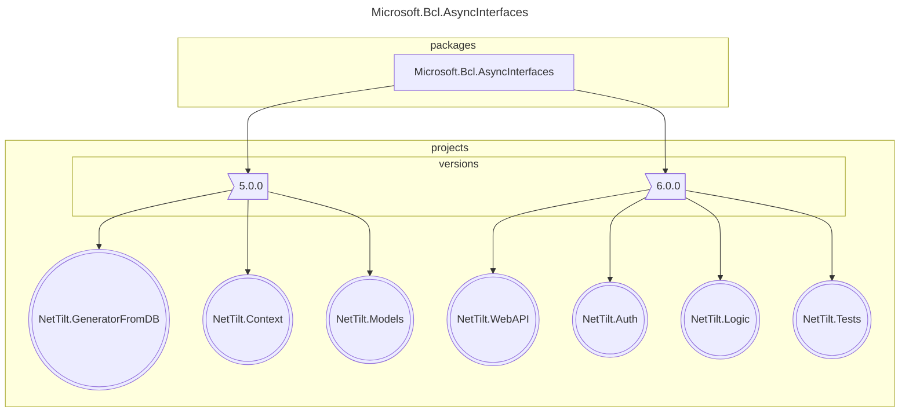

## 2 Microsoft.Data.SqlClient

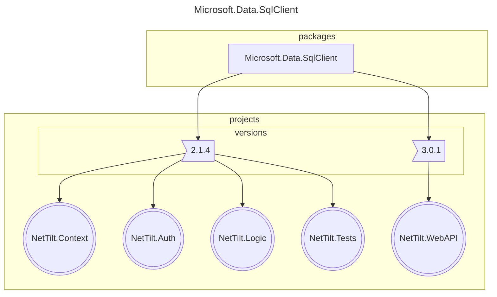

## 3 Microsoft.Data.SqlClient.SNI.runtime

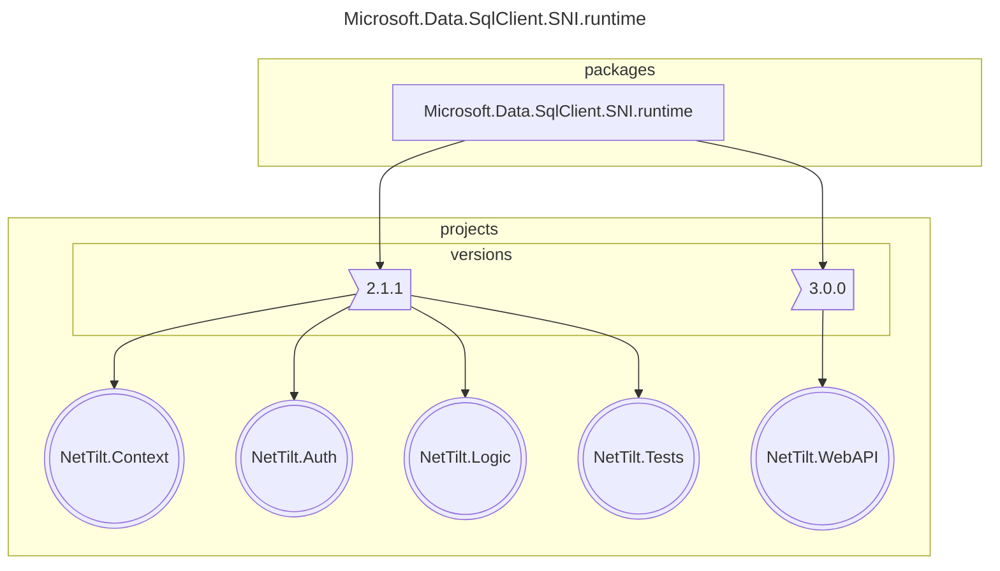

## 4 Microsoft.Extensions.Configuration

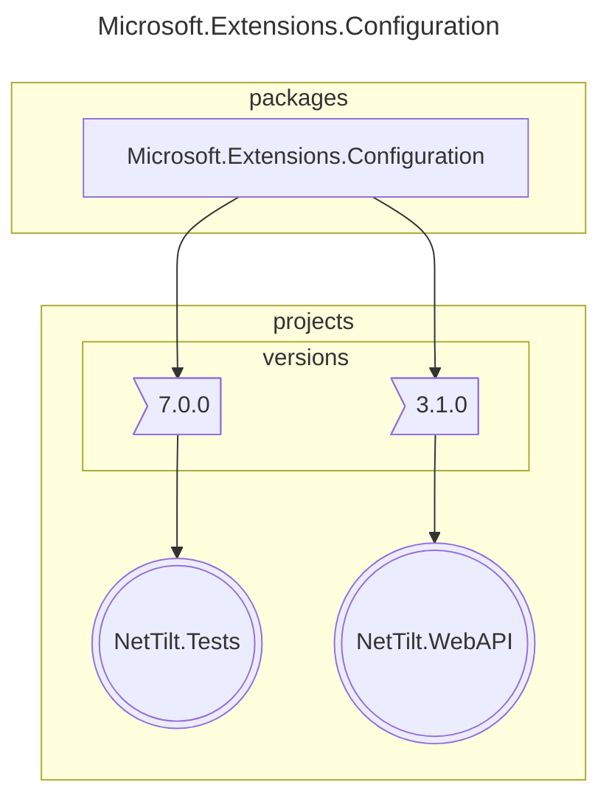

## 5 Microsoft.Extensions.Configuration.Abstractions

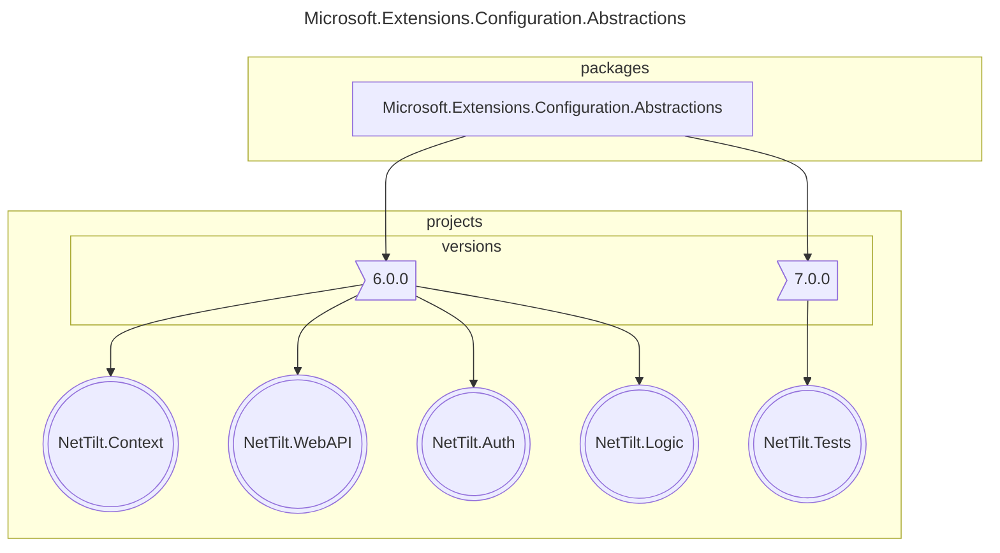

## 6 Microsoft.Extensions.DependencyInjection

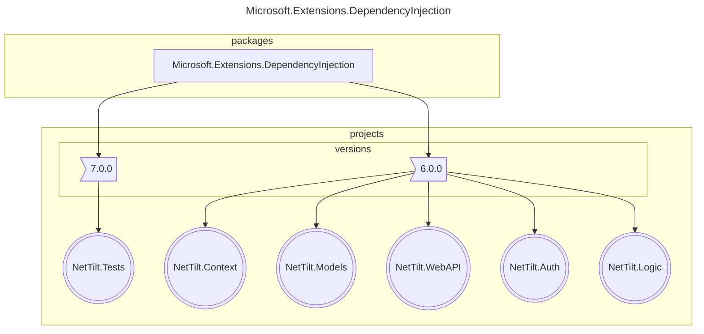

## 7 Microsoft.Extensions.DependencyInjection.Abstractions

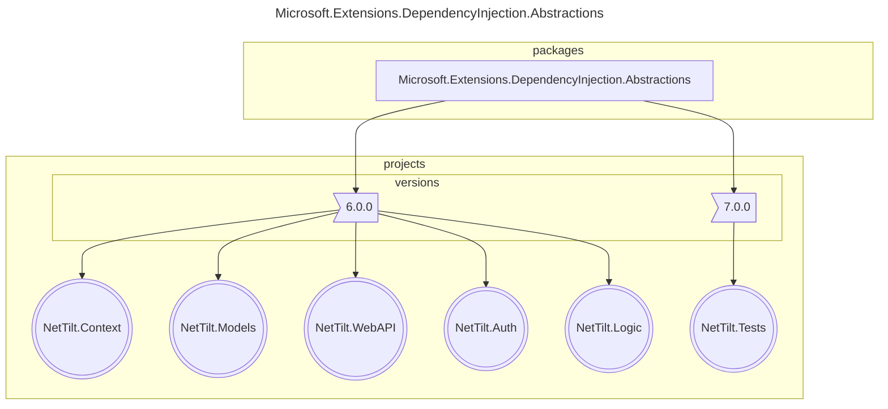

## 8 Microsoft.Extensions.Primitives

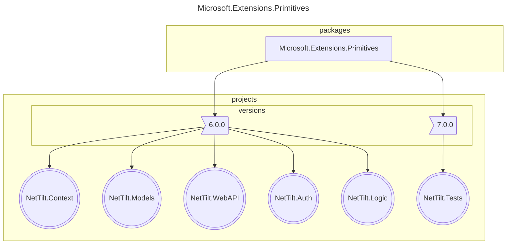

## 9 Microsoft.NETCore.Platforms

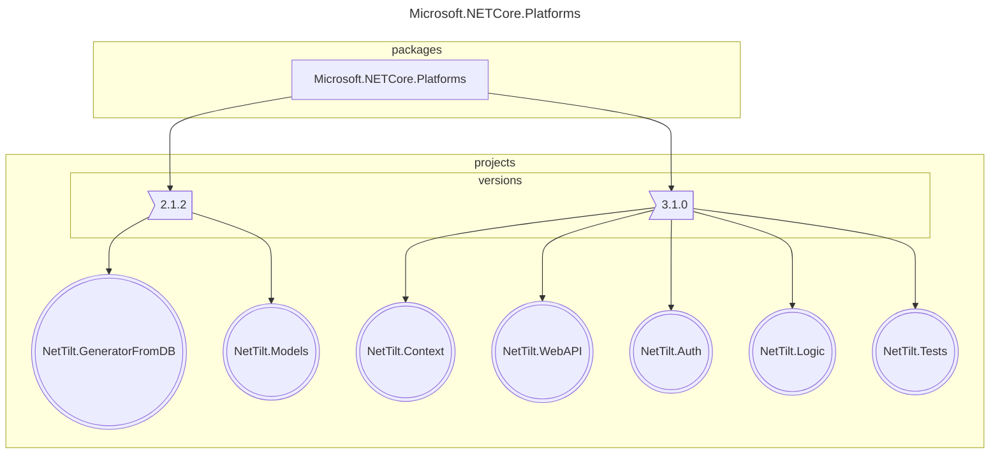

## 10 NETStandard.Library

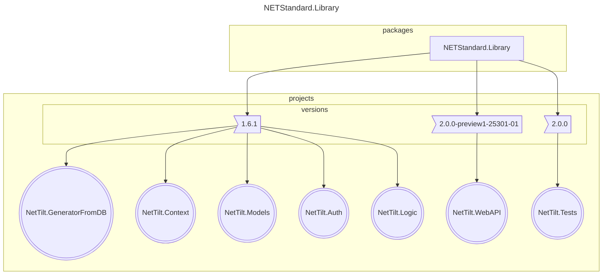

## 11 Newtonsoft.Json

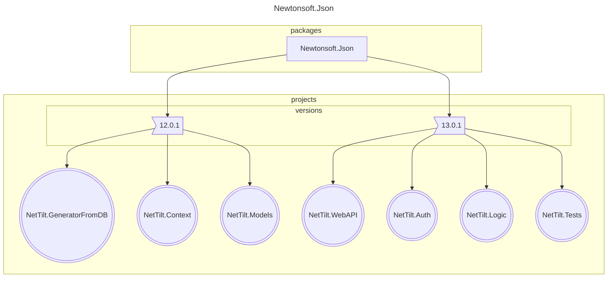

## 12 System.Collections.Immutable

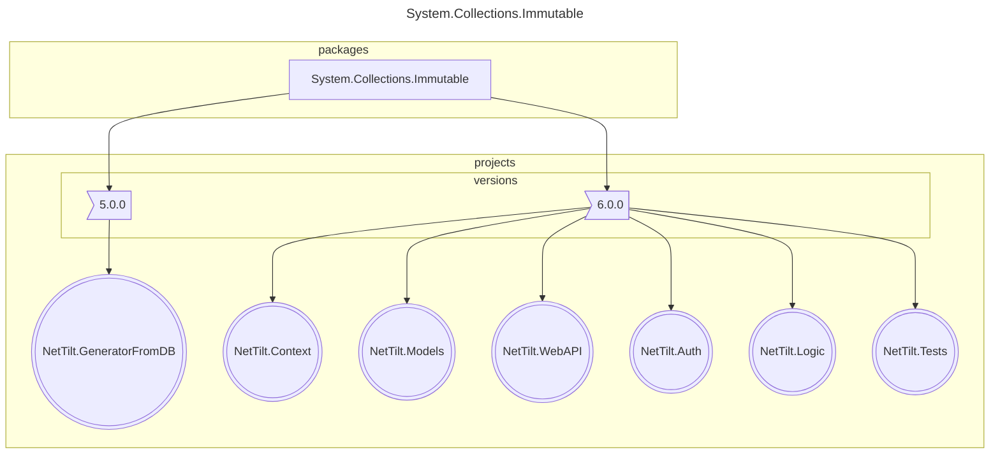

## 13 System.Diagnostics.DiagnosticSource

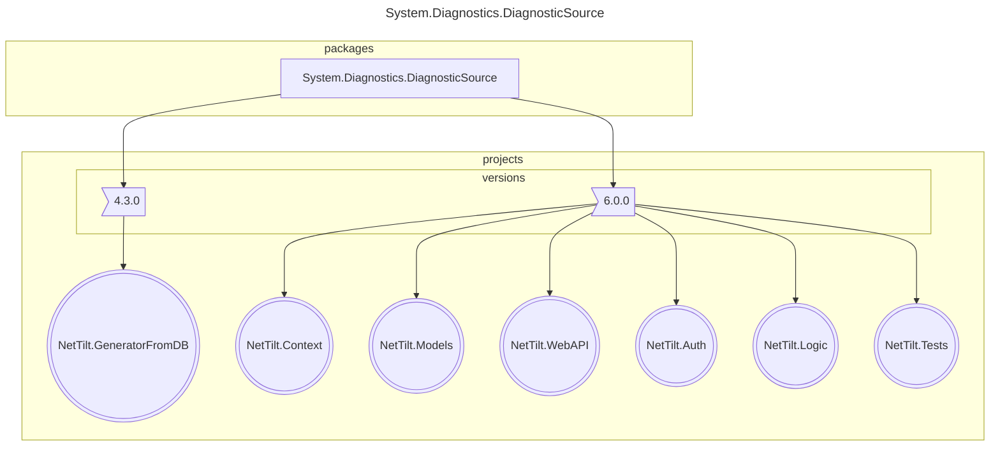

## 14 System.Runtime.CompilerServices.Unsafe

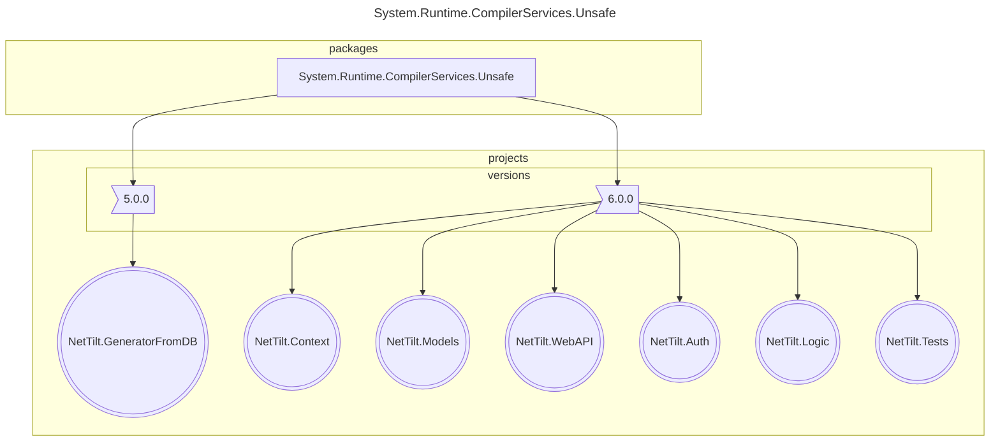
<small>Generated  by https://www.nuget.org/packages/netpackageanalyzerconsole , version 7.2023.830.921</small>
