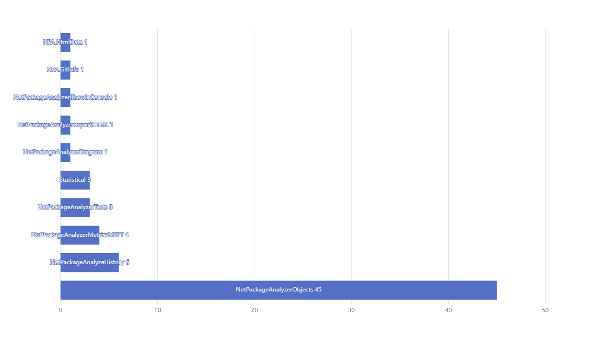
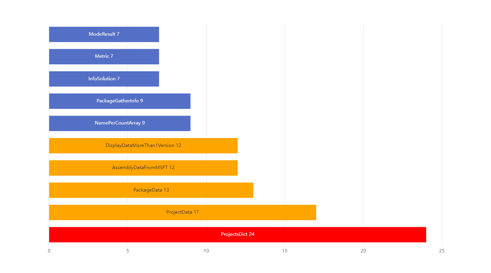

# Summary for NetPackageAnalyzer

## Project relations

## Project Data

### Public Classes per project

### Number lines per project

## Class data

### Public methods per class

### Number methods per class

### Number lines per class

## Method data

### Cyclomatic complexity per method

### Maintainability index per method

### Number lines per method

## Commits

### File with most commits

### Commits per year and project

