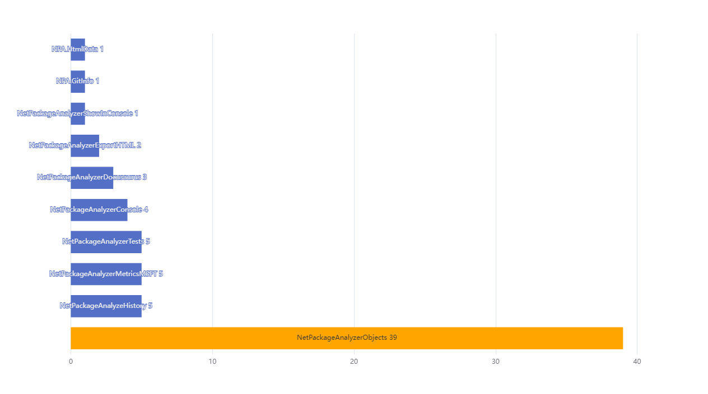
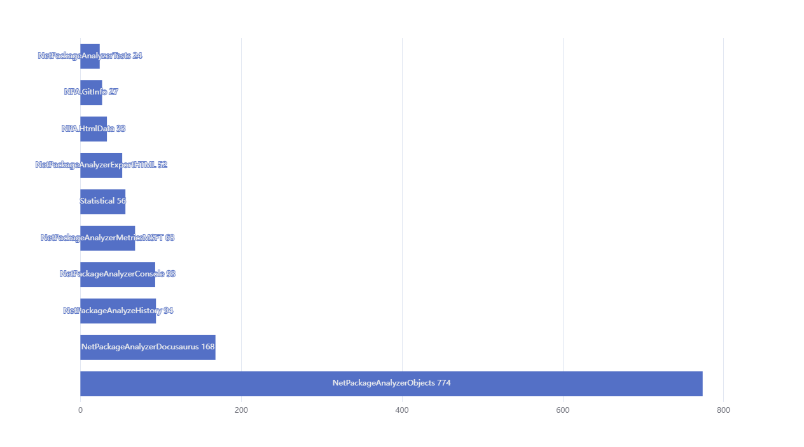
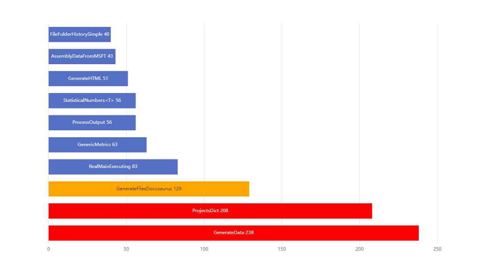
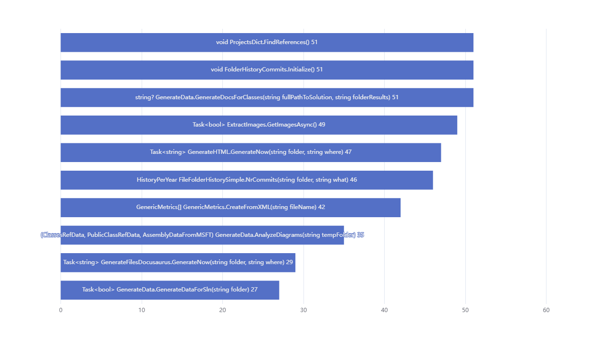
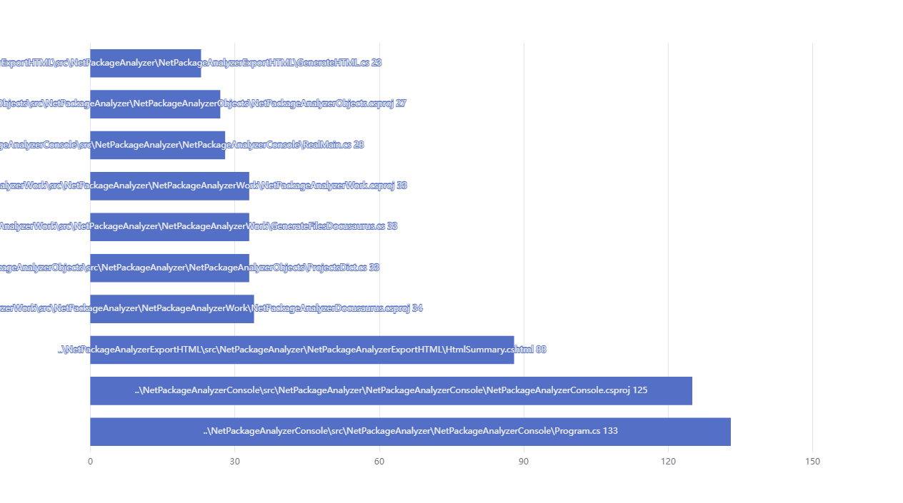
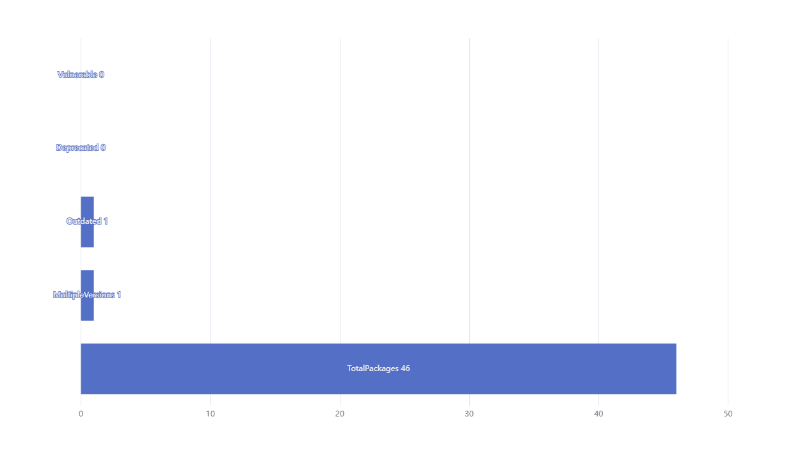

# Summary for NetPackageAnalyzer

    Repo : https://github.com/ignatandrei/PackageAnalyzer
    
    Branch : main 
    
    Commit : 14e4a355f8b09223fefeb2b7673c7ce170b28295
    

## Project relations

## Project Data

### All Classes per project

### Number lines per project

## Class data

### Number methods per class

### Number lines per class

## Method data

### Cyclomatic complexity per method

### Maintainability index per method

### Number lines per method

## Commits

### File with most commits

### Commits per year and project

## Packages

### Packages

### Generation data

Generated  by https://www.nuget.org/packages/NetPackageAnalyzerConsole</a>
    
version 9.2024.1208.2022 with Halldór Laxness is feeling romantic in Harare 

Generated on 2024-12-09 18:10:27 