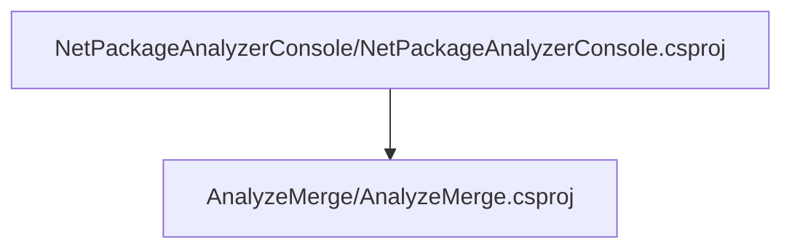

# Project relations for AnalyzeMerge

# Projects that reference AnalyzeMerge

# Full Project relations for AnalyzeMerge

[Packages](Packages.md)

[Back To Solution](../../ProjectRelation.md)

<small>Generated  by https://www.nuget.org/packages/netpackageanalyzerconsole , version 8.2024.308.841</small>

