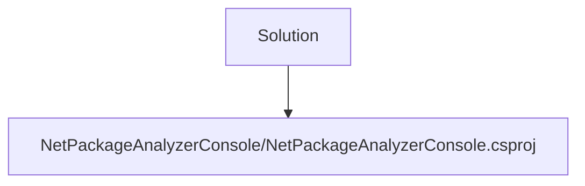
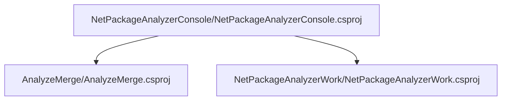
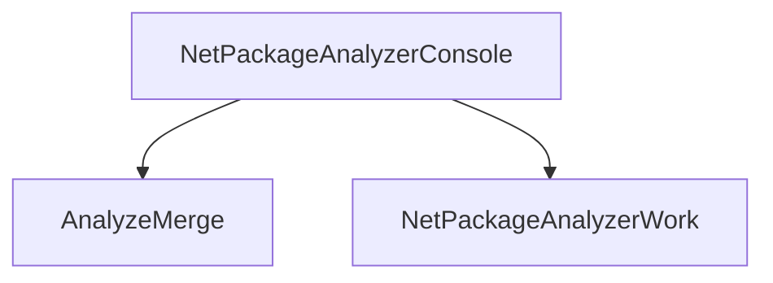

# Projects relations

## Root Projects

## NetPackageAnalyzerConsole

[Relations](Projects/NetPackageAnalyzerConsole/ProjectReferences.md)

[Packages](Projects/NetPackageAnalyzerConsole/Packages.md)

## Building Blocks - Projects with 0 project references 

### [AnalyzeMerge Relations ](Projects/AnalyzeMerge/ProjectReferences.md)

### [AnalyzeMerge Packages](Projects/AnalyzeMerge/Packages.md)

### [NetPackageAnalyzerWork Relations ](Projects/NetPackageAnalyzerWork/ProjectReferences.md)

### [NetPackageAnalyzerWork Packages](Projects/NetPackageAnalyzerWork/Packages.md)

## All Projects Graph

<small>Generated  by https://www.nuget.org/packages/netpackageanalyzerconsole , version 8.2024.315.1900</small>

