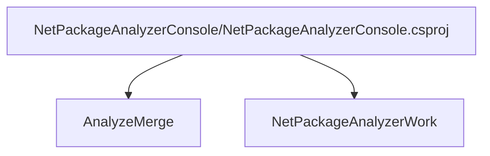
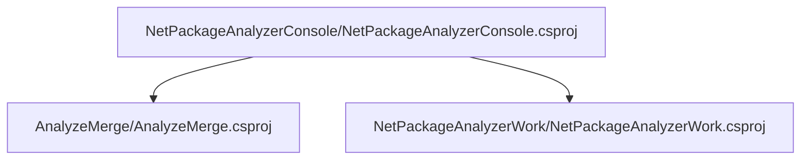

# Project relations for NetPackageAnalyzerConsole

# Projects that reference NetPackageAnalyzerConsole

# Full Project relations for NetPackageAnalyzerConsole

[Packages](Packages.md)

[Back To Solution](../../ProjectRelation.md)

<small>Generated  by https://www.nuget.org/packages/netpackageanalyzerconsole , version 8.2024.403.2200</small>

