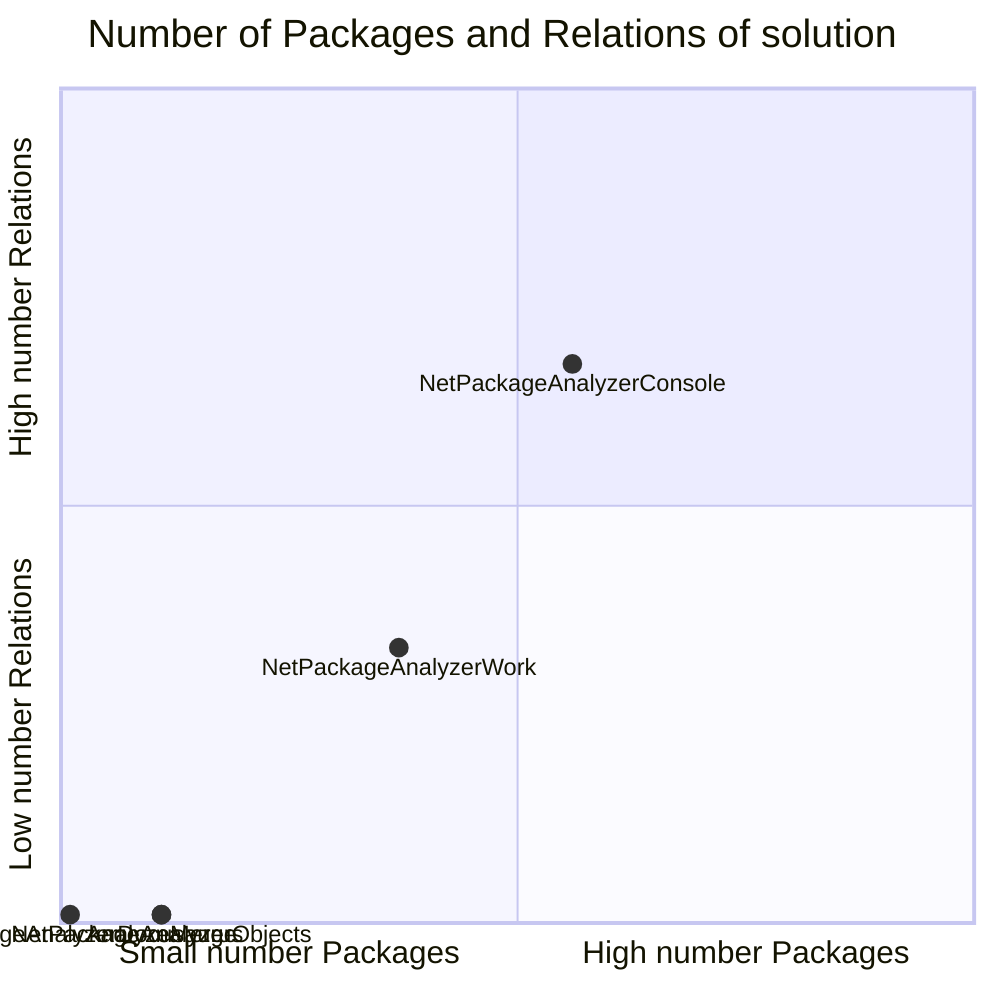
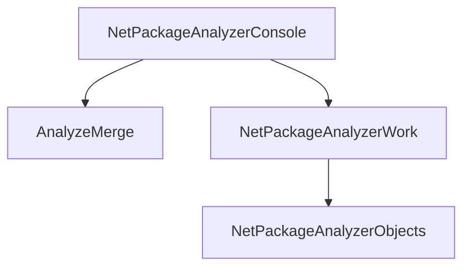

# Projects relations (not included tests)

## Quadrant Packages / Relations

## All Projects Graph

<small>Generated  by https://www.nuget.org/packages/netpackageanalyzerconsole , version 1.0.0.0</small>

