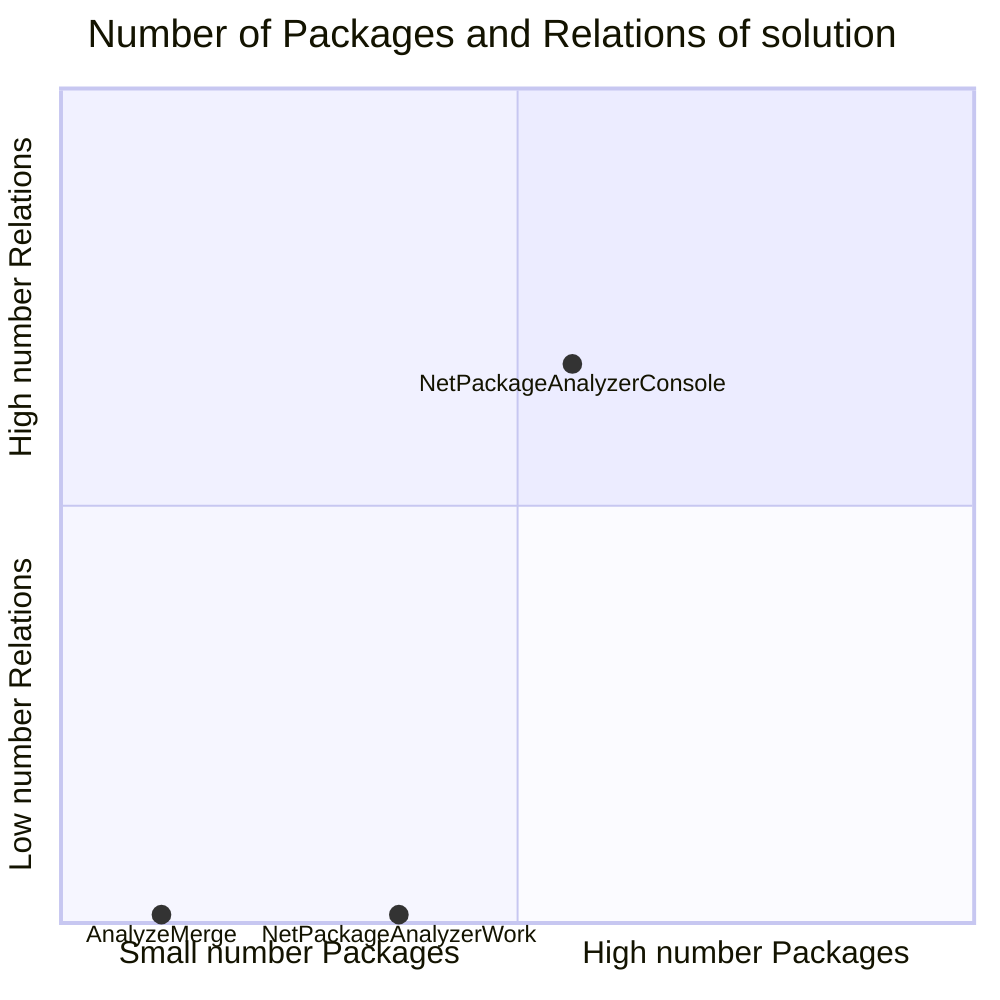
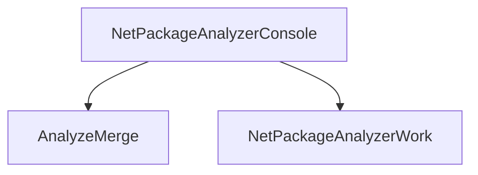

# Projects relations (not included tests)

## Quadrant Packages / Relations

## All Projects Graph

<small>Generated  by https://www.nuget.org/packages/netpackageanalyzerconsole , version 8.2024.309.2334</small>

