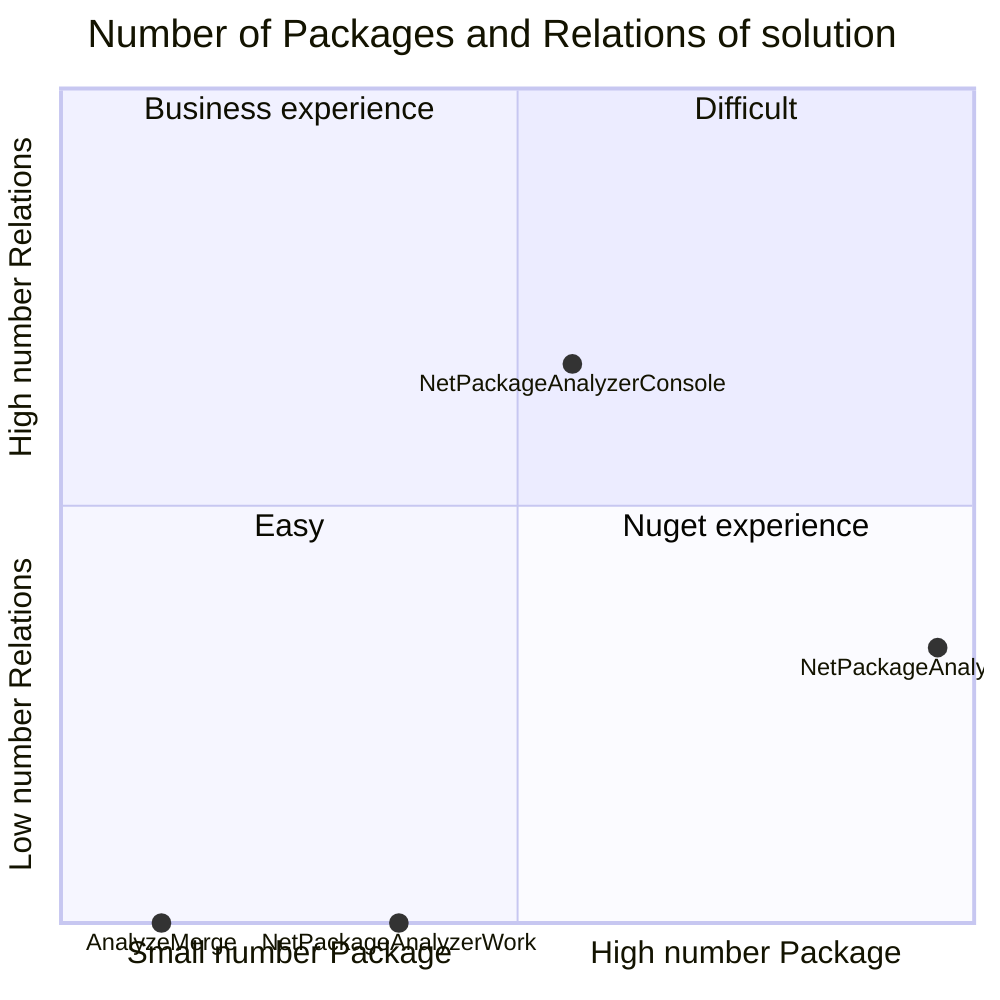
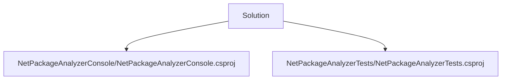
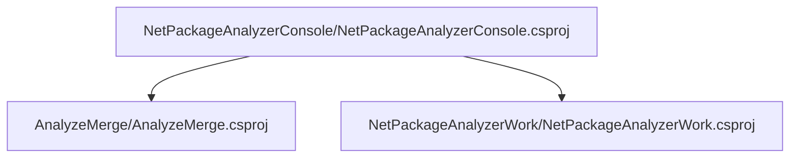
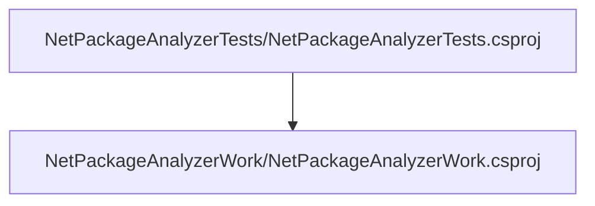
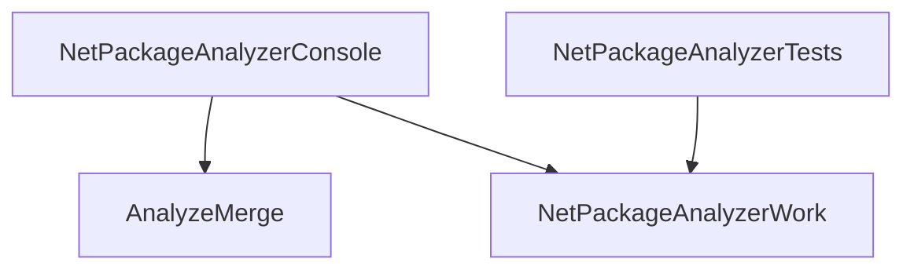

# Projects relations

## Data

## Building Blocks - Projects with 0 project references

### AnalyzeMerge

Full Name : AnalyzeMerge/AnalyzeMerge.csproj

[AnalyzeMerge Relations ](pathname:///docs/Analysis/NetPackageAnalyzer/Projects/AnalyzeMerge/ProjectReferences)

[AnalyzeMerge Packages](pathname:///docs/Analysis/NetPackageAnalyzer/Projects/AnalyzeMerge/Packages)

    

### NetPackageAnalyzerWork

Full Name : NetPackageAnalyzerWork/NetPackageAnalyzerWork.csproj

[NetPackageAnalyzerWork Relations ](pathname:///docs/Analysis/NetPackageAnalyzer/Projects/NetPackageAnalyzerWork/ProjectReferences)

[NetPackageAnalyzerWork Packages](pathname:///docs/Analysis/NetPackageAnalyzer/Projects/NetPackageAnalyzerWork/Packages)

    

## Root Projects - projects that are not referenced anywhere

### NetPackageAnalyzerConsole

[Relations](pathname:///docs/Analysis/NetPackageAnalyzer/Projects/NetPackageAnalyzerConsole/ProjectReferences)

[Packages](pathname:///docs/Analysis/NetPackageAnalyzer/Projects/NetPackageAnalyzerConsole/Packages)

### NetPackageAnalyzerTests

[Relations](pathname:///docs/Analysis/NetPackageAnalyzer/Projects/NetPackageAnalyzerTests/ProjectReferences)

[Packages](pathname:///docs/Analysis/NetPackageAnalyzer/Projects/NetPackageAnalyzerTests/Packages)

## All Projects Graph

<small>Generated  by https://www.nuget.org/packages/netpackageanalyzerconsole , version 8.2024.309.1834</small>

