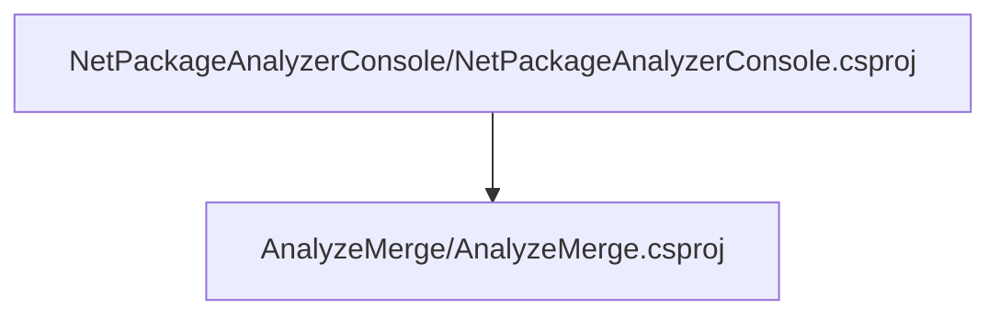

# Project relations for AnalyzeMerge

# Projects that reference AnalyzeMerge

        [NetPackageAnalyzerConsole](pathname:///docs/Analysis/NetPackageAnalyzer/Projects/NetPackageAnalyzerConsole/ProjectReferences)
    

# Full Project relations for AnalyzeMerge

[Packages](Packages)

[Back To Solution](pathname:///docs/Analysis/NetPackageAnalyzer/ProjectRelation)

<small>Generated  by https://www.nuget.org/packages/NetPackageAnalyzerDocusaurus , version 8.2024.311.2139</small>

