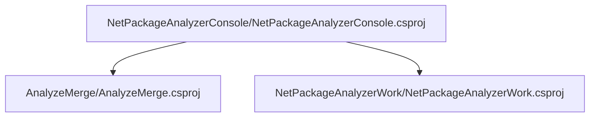

# Project relations for NetPackageAnalyzerConsole

        [AnalyzeMerge](pathname:///docs/Analysis/NetPackageAnalyzer/Projects/AnalyzeMerge/ProjectReferences)
    
        [NetPackageAnalyzerWork](pathname:///docs/Analysis/NetPackageAnalyzer/Projects/NetPackageAnalyzerWork/ProjectReferences)
    

# Projects that reference NetPackageAnalyzerConsole

# Full Project relations for NetPackageAnalyzerConsole

[Packages](Packages)

[Back To Solution](pathname:///docs/Analysis/NetPackageAnalyzer//ProjectRelation)

<small>Generated  by https://www.nuget.org/packages/netpackageanalyzerconsole , version 8.2024.309.2334</small>

