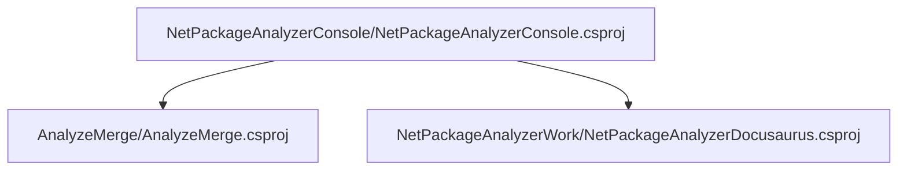
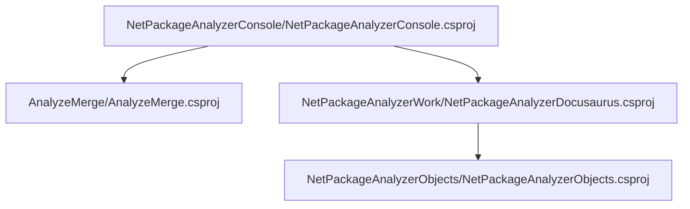

# Project relations for NetPackageAnalyzerConsole

        [AnalyzeMerge](pathname:///docs/Analysis/NetPackageAnalyzer/Projects/AnalyzeMerge/ProjectReferences)
    
        [NetPackageAnalyzerDocusaurus](pathname:///docs/Analysis/NetPackageAnalyzer/Projects/NetPackageAnalyzerDocusaurus/ProjectReferences)
    

# Projects that reference NetPackageAnalyzerConsole

# Full Project relations for NetPackageAnalyzerConsole

[Packages](Packages)

[Back To Solution](pathname:///docs/Analysis/NetPackageAnalyzer/ProjectRelation)

<small>Generated  by https://www.nuget.org/packages/NetPackageAnalyzerDocusaurus , version 8.2024.310.1936</small>

