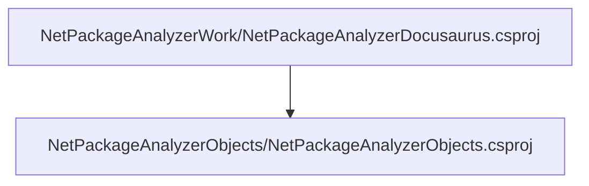
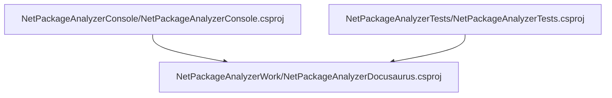

# Project relations for NetPackageAnalyzerDocusaurus

        [NetPackageAnalyzerObjects](pathname:///docs/Analysis/NetPackageAnalyzer/Projects/NetPackageAnalyzerObjects/ProjectReferences)
    

# Projects that reference NetPackageAnalyzerDocusaurus

        [NetPackageAnalyzerConsole](pathname:///docs/Analysis/NetPackageAnalyzer/Projects/NetPackageAnalyzerConsole/ProjectReferences)
    
        [NetPackageAnalyzerTests](pathname:///docs/Analysis/NetPackageAnalyzer/Projects/NetPackageAnalyzerTests/ProjectReferences)
    

# Full Project relations for NetPackageAnalyzerDocusaurus

[Packages](Packages)

[Back To Solution](pathname:///docs/Analysis/NetPackageAnalyzer/ProjectRelation)

<small>Generated  by https://www.nuget.org/packages/NetPackageAnalyzerDocusaurus , version 8.2024.311.2139</small>

