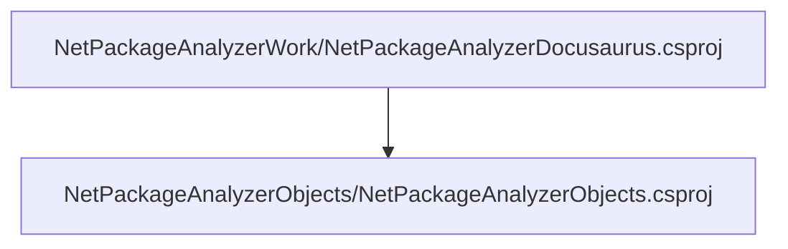

# Project relations for NetPackageAnalyzerObjects

# Projects that reference NetPackageAnalyzerObjects

        [NetPackageAnalyzerDocusaurus](pathname:///docs/Analysis/NetPackageAnalyzer/Projects/NetPackageAnalyzerDocusaurus/ProjectReferences)
    

# Full Project relations for NetPackageAnalyzerObjects

[Packages](Packages)

[Back To Solution](pathname:///docs/Analysis/NetPackageAnalyzer//ProjectRelation)

<small>Generated  by https://www.nuget.org/packages/NetPackageAnalyzerDocusaurus , version 8.2024.310.1936</small>

