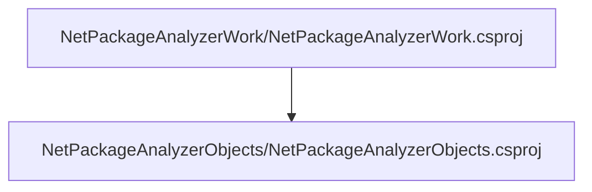

# Project relations for NetPackageAnalyzerObjects

# Projects that reference NetPackageAnalyzerObjects

        [NetPackageAnalyzerWork](pathname:///docs/Analysis/NetPackageAnalyzer/Projects/NetPackageAnalyzerWork/ProjectReferences)
    

# Full Project relations for NetPackageAnalyzerObjects

[Packages](Packages)

[Back To Solution](pathname:///docs/Analysis/NetPackageAnalyzer//ProjectRelation)

<small>Generated  by https://www.nuget.org/packages/netpackageanalyzerconsole , version 1.0.0.0</small>

