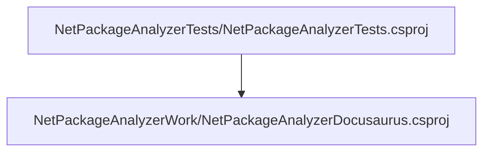
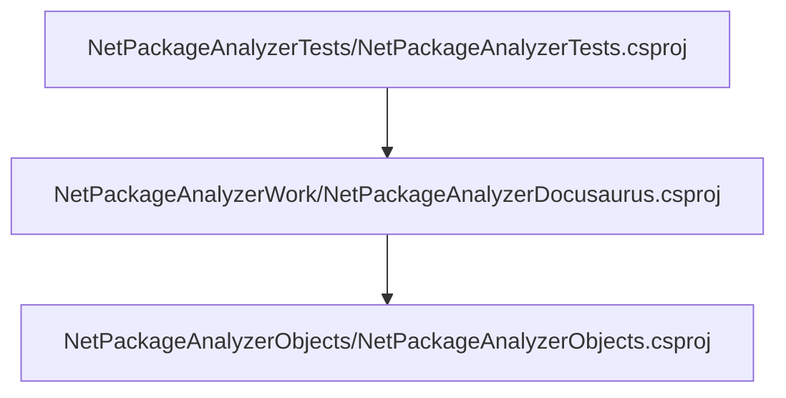

# Project relations for NetPackageAnalyzerTests

        [NetPackageAnalyzerDocusaurus](pathname:///docs/Analysis/NetPackageAnalyzer/Projects/NetPackageAnalyzerDocusaurus/ProjectReferences)
    

# Projects that reference NetPackageAnalyzerTests

# Full Project relations for NetPackageAnalyzerTests

[Packages](Packages)

[Back To Solution](pathname:///docs/Analysis/NetPackageAnalyzer/ProjectRelation)

<small>Generated  by https://www.nuget.org/packages/NetPackageAnalyzerDocusaurus , version 8.2024.311.2139</small>

