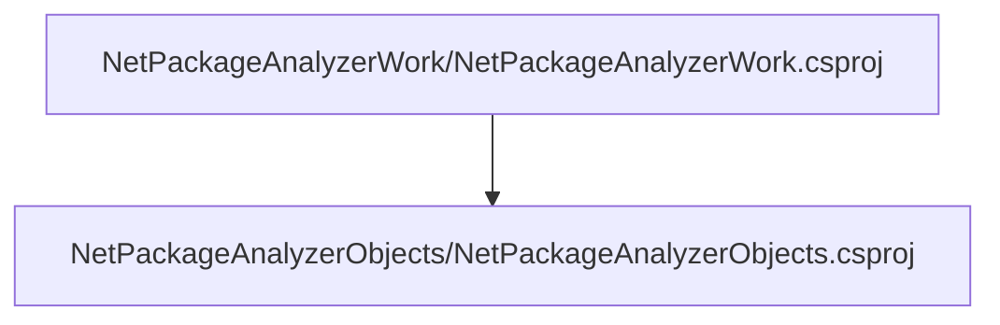
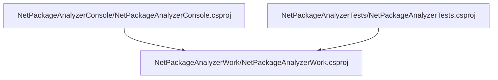

# Project relations for NetPackageAnalyzerWork

        [NetPackageAnalyzerObjects](pathname:///docs/Analysis/NetPackageAnalyzer/Projects/NetPackageAnalyzerObjects/ProjectReferences)
    

# Projects that reference NetPackageAnalyzerWork

        [NetPackageAnalyzerConsole](pathname:///docs/Analysis/NetPackageAnalyzer/Projects/NetPackageAnalyzerConsole/ProjectReferences)
    
        [NetPackageAnalyzerTests](pathname:///docs/Analysis/NetPackageAnalyzer/Projects/NetPackageAnalyzerTests/ProjectReferences)
    

# Full Project relations for NetPackageAnalyzerWork

[Packages](Packages)

[Back To Solution](pathname:///docs/Analysis/NetPackageAnalyzer//ProjectRelation)

<small>Generated  by https://www.nuget.org/packages/netpackageanalyzerconsole , version 1.0.0.0</small>

