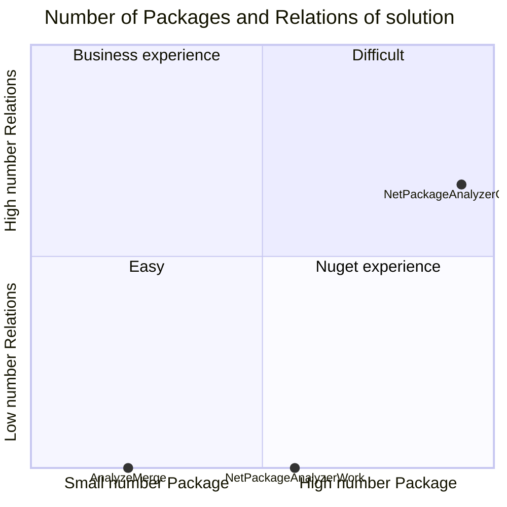
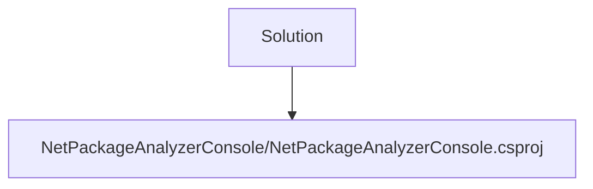
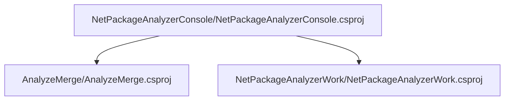
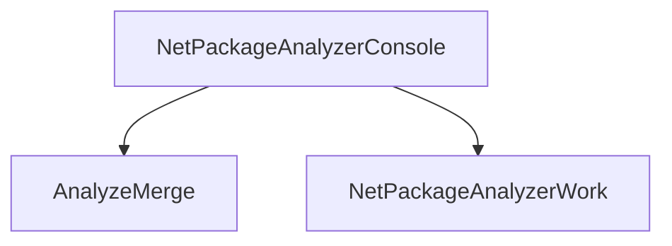

# Projects relations

## Data

## Building Blocks - Projects with 0 project references

        ### AnalyzeMerge

        Full Name : AnalyzeMerge/AnalyzeMerge.csproj

        [AnalyzeMerge Relations ](Projects/AnalyzeMerge/ProjectReferences.md)

        [AnalyzeMerge Packages](Projects/AnalyzeMerge/Packages.md)

    

        ### NetPackageAnalyzerWork

        Full Name : NetPackageAnalyzerWork/NetPackageAnalyzerWork.csproj

        [NetPackageAnalyzerWork Relations ](Projects/NetPackageAnalyzerWork/ProjectReferences.md)

        [NetPackageAnalyzerWork Packages](Projects/NetPackageAnalyzerWork/Packages.md)

    

## Root Projects - projects that are not referenced anywhere

### NetPackageAnalyzerConsole

[Relations](Projects/NetPackageAnalyzerConsole/ProjectReferences.md)

[Packages](Projects/NetPackageAnalyzerConsole/Packages.md)

## All Projects Graph

<small>Generated  by https://www.nuget.org/packages/netpackageanalyzerconsole , version 8.2024.309.1109</small>

